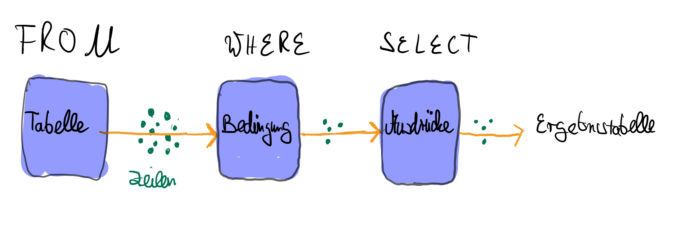

# Selektion und Projektion

SQL wird in der Regel nicht als Taschenrechner, sondern als
Abfragesprache für Datenbanken genutzt. Das sagt auch der volle Name
*Structured Query Language* aus.

Um Abfragen zu schreiben, müssen wir zunächst eine Datenbank erstellen.
Deshalb wird zu Beginn jedes Kapitels eine Datenbank neu aufgebaut,
damit alle Abfragen auf einer definierten Ausgangslage basieren.

```sql
CREATE TABLE fahrradarten (
    fahrradartNr     int NOT NULL,
    bezeichnung      varchar(50),
    PRIMARY KEY (fahrradartNr)
);
```

<codapi-snippet engine="pglite" sandbox="postgres" editor="null" output-mode="table">
</codapi-snippet>

```sql
INSERT INTO fahrradarten VALUES
(1, 'Mountain-Bike'),
(2, 'Cross-Bike'),
(3, 'BMX-Bike'),
(4, 'DirtBike'),
(5, 'Einrad'),
(6, 'Tandem'),
(7, 'Kinderfahrrad ab 20 Zoll'),
(8, 'Jugendfahrrad'),
(9, 'Kinderrad Fahrrad 12-18 Zoll'),
(10, 'Jugendfahrrad ab 26 Zoll'),
(11, 'Rennrad'),
(12, 'Damen City-Bike'),
(13, 'Herren City-Bike'),
(14, 'Kinderanhänger');
```

<codapi-snippet engine="pglite" sandbox="postgres" editor="null" output-mode="table">
</codapi-snippet>

```sql
CREATE TABLE fahrraeder (
    fahrradNr        int NOT NULL,
    bezeichnung      varchar(50),
    tagesmietpreis   double precision,
    fahrradartNr     int,
    PRIMARY KEY (fahrradNr),
    FOREIGN KEY (fahrradartNr) REFERENCES fahrradarten (fahrradartNr)
);
```

<codapi-snippet engine="pglite" sandbox="postgres" editor="null" output-mode="table">
</codapi-snippet>

```sql
INSERT INTO fahrraeder VALUES
(1, 'Comus Einrad', 8.40, 5),
(2, 'Panther Thedy', 9.45, 9),
(3, 'Scott Comtessa', 10.50, 9),
(4, 'Scott Voltage Jr 16', 12.60, 9),
(5, 'Yazoo FSV-3.6N', 17.85, 10),
(6, 'Scott Aspect 50', 19.95, 1),
(7, 'Yazoo FSV-3.6N', 17.85, 10),
(8, 'Comus Einrad XM', 8.40, 5);
```

<codapi-snippet engine="pglite" sandbox="postgres" editor="null" output-mode="table">
</codapi-snippet>

```sql
CREATE TABLE kunden (
    kundenNr   int NOT NULL,
    name       varchar(30),
    vorname    varchar(20),
    geschlecht varchar(1),
    PRIMARY KEY (kundenNr)
);
```

<codapi-snippet engine="pglite" sandbox="postgres" editor="null" output-mode="table">
</codapi-snippet>

```sql
INSERT INTO kunden VALUES
(232, 'Schneider', 'Heinrich', 'm'),
(233, 'Schlauch', 'Franz', 'm'),
(234, 'Schlauch', 'Franziska', 'w'),
(235, 'Böckle', 'Jennifer', 'w'),
(236, 'Hauffe', 'Johann', 'm'),
(237, 'Yilmaz', 'Ali', 'm'),
(238, 'Berger', 'Johann', 'm');
```
<codapi-snippet engine="pglite" sandbox="postgres" editor="null" output-mode="table">
</codapi-snippet>


Um schnell einen Überblick über eine Datenbank zu bekommen, nutzt man
Diagramme. Darin sind alle Tabellen und ihre Spalten zu sehen, aber
keine Datensätze. Jedes Rechteck steht für eine Tabelle: oben der
Tabellenname, darunter die Spalten mit Datentypen. Beziehungen zwischen
Tabellen sind als Linien eingezeichnet.


## Ganze Tabellen anzeigen

Um eine ganze Tabelle anzuzeigen, schreibt man hinter `SELECT` ein
`*` und in die nächste Zeile das Schlüsselwort `FROM` und
den Namen der gewünschten Tabelle. Die oben aufgeführte Tabelle erhält
man mit dem folgenden Befehl.

```sql
SELECT *
FROM Kunden;
```
<codapi-snippet engine="pglite" sandbox="postgres" editor="null" output-mode="table">
</codapi-snippet>

## Projektionen

Mit `SELECT`-Befehlen können wir auch nur ausgewählte Spalten
einer Tabelle anschauen. Hierfür schreibt man hinter `SELECT` die
Namen der gewünschten Spalten. Zwischen zwei Spaltennamen muss ein Komma
stehen. Anschließend folgt das Schlüsselwort `FROM` und der Name
der Tabelle, aus der die Spalten stammen.

```sql
SELECT vorname, name
FROM Kunden;
```
<codapi-snippet engine="pglite" sandbox="postgres" editor="null" output-mode="table">
</codapi-snippet>


Eine solche Auswahl von Spalten einer Tabelle nennt man Projektion.

## Berechnete Spalten

Wir haben bereits gesehen, dass man mit `SELECT`-Statements die
Werte von Ausdrücken berechnen kann. Dies können wir auch mit der Abfrage
von Spalten verbinden.

Ein Kunde könnte sich zum Beispiel für Fahrräder interessieren, deren
Tagesmietpreis unter 10 € liegt.


Um auch diese Information anzuzeigen, könnte er die folgende Abfrage
stellen:

```sql
SELECT fahrradNr, bezeichnung, tagesmietpreis < 10
FROM Fahrraeder;
```
<codapi-snippet engine="pglite" sandbox="postgres" editor="null" output-mode="table">
</codapi-snippet>


Für jede Zeile in der Tabelle *Fahrraeder* wird dann aus dem Wert in der
Spalte *tagesmietpreis* der Wert des angegebenen Ausdrucks berechnet und
in der Ergebnistabelle angezeigt.

Um nicht immer den Ausdruck selbst im Kopf der Spalte anzuzeigen, ist es
sinnvoll, mit dem Schlüsselwort `AS` zu arbeiten.

```sql
SELECT fahrradNr, bezeichnung, tagesmietpreis < 10 AS
tagesmietpreis_unter_10_euro FROM Fahrraeder;
```
<codapi-snippet engine="pglite" sandbox="postgres" editor="null" output-mode="table">
</codapi-snippet>


## Selektion

Wenn du nur Fahrräder mit einem Tagesmietpreis unter 10 € sehen willst,
filterst du die Tabelle über eine Bedingung.


Dafür ergänzt du das `SELECT`-Statement um eine `WHERE`-Klausel.
Hinter `WHERE` steht die Bedingung.
Nur Zeilen, die diese Bedingung erfüllen, erscheinen im Ergebnis.

```sql
SELECT fahrradNr, bezeichnung
FROM Fahrraeder
WHERE tagesmietpreis < 10;
```
<codapi-snippet engine="pglite" sandbox="postgres" editor="null" output-mode="table">
</codapi-snippet>


Eine solche Auswahl von Zeilen nennt man Selektion.

## Veranschaulichung

In den bisherigen Abfragen steht in `FROM` genau eine Tabelle.
Mit `WHERE` filterst du die Zeilen.
Nur passende Zeilen bleiben übrig.
Hinter `SELECT` stehen Spaltennamen oder Ausdrücke.
Diese werden für jede verbleibende Zeile berechnet.
Die berechneten Werte bilden die Ergebnismenge.



