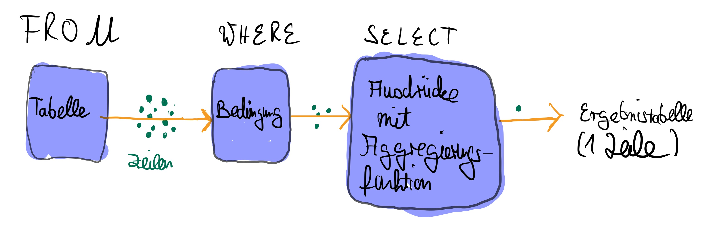

# Aggregierungen

Mithilfe von Aggregierungsfunktionen können wir aus allen Werten in
einer Spalte einen einzelnen Wert berechnen. Ein Beispiel für eine
Aggregierungsfunktionen ist die Funktion `AVG`. Diese berechnet
den durchschnittlichen Wert in einer Spalte. Damit kann der
durchschnittliche *Tagesmietpreis* aller Fahrräder berechnet werden.

```sql
SELECT AVG(tagesmietpreis) 
FROM Fahrraeder;
```
<codapi-snippet engine="pglite" sandbox="postgres" editor="basic" output-mode="table">
</codapi-snippet>

Aus kosmetischen Gründen sollte man das Ergebnis runden und einen Alias
verwenden.

```sql
SELECT ROUND(AVG(tagesmietpreis), 3) AS 'Durchschnittlicher Tagesmietpreis' 
FROM Fahrraeder;
```
<codapi-snippet engine="pglite" sandbox="postgres" editor="basic" output-mode="table">
</codapi-snippet>

    *Durchschnittlicher Tagesmietpreis*
  -------------------------------------
                                19.1912

\
Die wichtigsten Aggregierungsfunktionen sind in der folgenden Tabelle
aufgeführt.

       Name       Rückgabewert
  --------------- --------------------------------------
    `MAX`   größter Wert in der Spalte
    `MIN`   kleinster Wert in der Spalte
    `SUM`   Summe der Werte in der Spalte
    `AVG`   Durchschnitt der Werte in der Spalte
   `COUNT`  Anzahl der Werte in der Spalte

  : Wichtige Aggregierungssfunktionen

Mit der Funktion `COUNT` kann auch die Anzahl der zurückgegebenen
Zeilen gezählt werden. Hierfür schreibt man in die Klammer hinter dem
Funktionsnamen nicht den Namen einer Spalte sondern das Zeichen
`*`. Wenn man die Anzahl der verschiedenen *verschiedenen* Werte
in einer Spalte berechnen, muss in der Klammer hinter `COUNT` vor
dem Spaltenname `DISTINCT` stehen.

```sql
SELECT COUNT(DISTINCT bezeichnung)
FROM Fahrraeder;
```
<codapi-snippet engine="pglite" sandbox="postgres" editor="basic" output-mode="table">
</codapi-snippet>

Es können auch mehrere aggregierte Werte auf einmal abgefragt werden.

```sql
SELECT COUNT(fahrradNr), AVG(tagesmietpreis) 
FROM Fahrraeder;
```
<codapi-snippet engine="pglite" sandbox="postgres" editor="basic" output-mode="table">
</codapi-snippet>


Es ist aber nicht möglich gleichzeitig Spalten und aggregierte Werte
abzufragen, da eine Spalte mehrere Werte enthalten kann und das Ergebnis
einer Aggregierungsfunktion nur ein einzelner Wert ist. pt In der
folgenden Grafik ist der Datenfluss bei der Aggregierung zu sehen.

<figure id="fig:SQL-SELECT-AGGR" data-latex-placement="H">

<figcaption>Datenfluss bei <code
class="sourceCode sql"><span class="kw">SELECT</span></code>-Statements
mit Aggregierung</figcaption>
</figure>

# Gruppierungen

Mithilfe von Gruppierungen können Teile der Tabelle anhand des Werts
einer Spalte oder eines Ausdrucks in Gruppen eingeteilt werden.
Anschließend kann mit einer Aggregierungsfunktion für jede Gruppe ein
Wert berechnet werden. Im folgenden Beispiel wurden alle Zeilen der
Tabelle *Fahrräder* nach der *Bezeichnung* gruppiert. Für jede dieser
Gruppen wurde dann die Anzahl der Fahrräder in der Gruppe berechnet.\

::: minipage
:::

::: minipage
:::

Dafür schreibt man hinter die Schlüsselwörter `GROUP` und
`BY` den Ausdruck, nach dem gruppiert werden soll.

```sql
SELECT COUNT(fahrradNr), bezeichnung 
FROM Fahrraeder 
GROUP BY bezeichnung;
```
<codapi-snippet engine="pglite" sandbox="postgres" editor="basic" output-mode="table">
</codapi-snippet>

Die Anzahl der Gruppen entspricht dann der Anzahl der verschiedenen
Werte, die der Ausdruck in den Zeilen der Tabelle annimmt. In diesem
Beispiel gibt es genau so viele Gruppen, wie es verschiedene
*Bezeichnungen* in der Tabelle *Fahrräder* gibt.

Wenn `GROUP BY` genutzt wird, dürfen hinter `SELECT` nur
Ausdrücke mit Aggregierungsfunktionen und der Ausdruck nach dem
gruppiert wurde, genutzt werden. Für alle anderen Ausdrücke ist nicht
klar, ob diese pro Gruppe nur einen Wert haben.

<figure id="fig:SQL-SELECT-AGGR-GROUP" data-latex-placement="h">

<figcaption>Datenfluss bei <code
class="sourceCode sql"><span class="kw">SELECT</span></code>-Statements
mit Gruppierung</figcaption>
</figure>

# Having

In der `WHERE`-Klausel kann man eine Bedingung angegeben. Damit
werden nur die Zeilen der Tabelle, die in der `FROM`-Klausel
angegeben wird, betrachtet, die diese Bedingung erfüllen.

Durch Gruppierung entsteht eine neue Tabelle. Auch diese kann nochmal
gefiltert werden. Dafür nutzt man die `HAVING`-Klausel. In dieser
gibt man eine Bedingung für die Gruppen an, die im Ergebnis
berücksichtigt werden sollen. In dieser Bedingung können nur Ausdrücke
mit Aggregierungsfunktionen oder der Gruppierungsausdruck verwendet
werden. Für alle anderen Ausdrücke ist wieder nicht klar, ob diese pro
Gruppe nur einen Wert haben.

```sql
SELECT COUNT(fahrradNr), bezeichnung 
FROM Fahrraeder 
GROUP BY bezeichnung
HAVING COUNT(fahrradNr) > 4;
```
<codapi-snippet engine="pglite" sandbox="postgres" editor="basic" output-mode="table">
</codapi-snippet>

        *\#*          *COUNT(FahrradNr)* *Bezeichnung*
  ---------- --------------------------- -------------------------------------------
           1   [5]{style="color: green"} [Bulls Sharptail 2]{style="color: green"}
           2    [5]{style="color: blue"} [Fishbone FR 100]{style="color: blue"}
    $\vdots$                    $\vdots$ $\vdots$

Der Datenfluss bei einem `SELECT`-Statement mit Gruppierung und
`HAVING`-Klausel ist in
[3](#fig:SQL-SELECT-AGGR-GROUP_Having){reference-type="ref+label"
reference="fig:SQL-SELECT-AGGR-GROUP_Having"} zu sehen.

<figure id="fig:SQL-SELECT-AGGR-GROUP_Having" data-latex-placement="H">

<figcaption>Datenfluss bei <code
class="sourceCode sql"><span class="kw">SELECT</span></code>-Statements
mit Gruppierung und <code
class="sourceCode sql"><span class="kw">HAVING</span></code>-Klausel</figcaption>
</figure>
