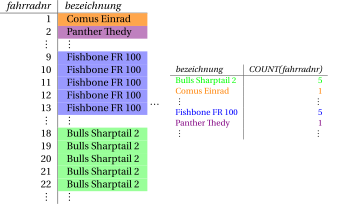
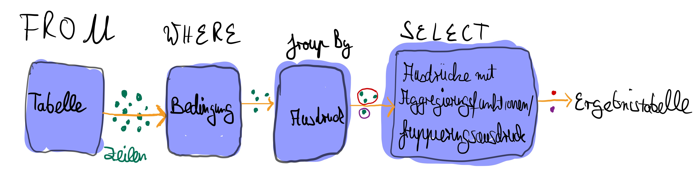
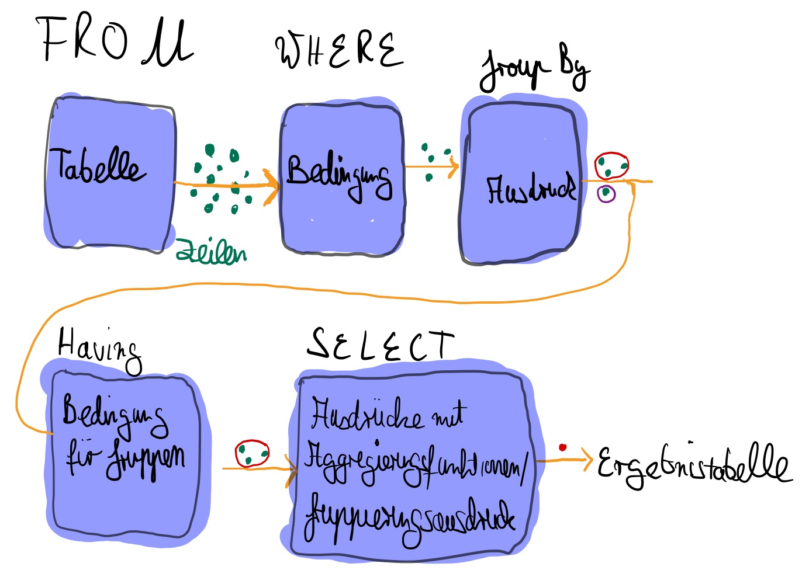

# Gruppierungen


```sql
CREATE TABLE fahrraeder (
    fahrradNr        int NOT NULL,
    bezeichnung      varchar(50),
    tagesmietpreis   double precision,
    fahrradartNr     int,
    PRIMARY KEY (fahrradNr)
);
```

<codapi-snippet>
</codapi-snippet>

```sql
INSERT INTO fahrraeder VALUES
(1, 'Comus Einrad', 8.40, 5),
(2, 'Panther Thedy', 9.45, 9),
(3, 'Scott Comtessa', 10.50, 9),
(4, 'Scott Voltage Jr 16', 12.60, 9),
(5, 'Yazoo FSV-3.6N', 17.85, 10),
(6, 'Scott Aspect 50', 19.95, 1),
(7, 'Yazoo FSV-3.6N', 17.85, 10),
(8, 'Comus Einrad XM', 8.40, 5),
(9, 'Fishbone FR 100', 19.95000, 3),
(10, 'Fishbone FR 100', 19.95000, 3),
(11, 'Fishbone FR 100', 19.95000, 3),
(12, 'Fishbone FR 100', 19.95000, 3),
(13, 'Fishbone FR 100', 19.95000, 3),
(14, 'Scott Comtessa', 10.50000, 9),
(15, 'Yazoo FSV-3.6N', 17.85000, 10),
(16, 'Scott Aspect 50', 19.95000, 1),
(17, 'Scott Aspect 50', 19.95000, 1),
(18, 'Bulls Sharptail 2', 21.00000, 1),
(19, 'Bulls Sharptail 2', 21.00000, 1),
(20, 'Bulls Sharptail 2', 21.00000, 1),
(21, 'Bulls Sharptail 2', 21.00000, 1),
(22, 'Bulls Sharptail 2', 21.00000, 1);
```
<codapi-snippet>
</codapi-snippet>

## Gruppierungen


Mithilfe von Gruppierungen können Zeilen der Tabelle anhand des Werts
einer Spalte oder eines Ausdrucks in Gruppen eingeteilt werden.
Anschließend kann mit einer Aggregierungsfunktion für jede Gruppe ein
Wert berechnet werden. Im folgenden Beispiel wurden alle Zeilen der
Tabelle *Fahrraeder* nach der *Bezeichnung* gruppiert. Für jede dieser
Gruppen wurde dann die Anzahl der Fahrräder berechnet.




Dafür schreibt man hinter die Schlüsselwörter `GROUP` und
`BY` den Ausdruck, nach dem gruppiert werden soll.

```sql
SELECT bezeichnung, COUNT(fahrradNr)
FROM fahrraeder
GROUP BY bezeichnung;
```
<codapi-snippet>
</codapi-snippet>

Die Anzahl der Gruppen entspricht dann der Anzahl der verschiedenen
Werte, die der Ausdruck in den Zeilen der Tabelle annimmt. In diesem
Beispiel gibt es genau so viele Gruppen, wie es verschiedene
*Bezeichnungen* in der Tabelle *Fahrraeder* gibt.

Wenn `GROUP BY` genutzt wird, dürfen hinter `SELECT` nur
Ausdrücke mit Aggregierungsfunktionen und der Ausdruck, nach dem
gruppiert wird, genutzt werden. Für alle anderen Ausdrücke ist nicht
klar, ob diese pro Gruppe nur einen Wert haben.





## HAVING

Mit `WHERE` formulierst du eine Bedingung für Zeilen.
Es werden nur Zeilen betrachtet, die diese Bedingung erfüllen.

Wichtig: `WHERE` filtert Zeilen vor der Gruppierung, `HAVING` filtert
Gruppen nach der Gruppierung.

Durch `GROUP BY` entsteht eine gruppierte Ergebnismenge.
Auch diese Ergebnismenge kannst du filtern: mit `HAVING`.
In `HAVING` sind nur Aggregatausdrücke oder der Gruppierungsausdruck erlaubt.
Für andere Ausdrücke ist pro Gruppe kein eindeutiger Einzelwert definiert.

```sql
SELECT COUNT(fahrradNr), bezeichnung
FROM fahrraeder
GROUP BY bezeichnung
HAVING COUNT(fahrradNr) > 4;
```
<codapi-snippet>
</codapi-snippet>


Die folgende Grafik zeigt den Datenfluss für eine
`SELECT`-Anweisung mit `GROUP BY` und `HAVING`.




